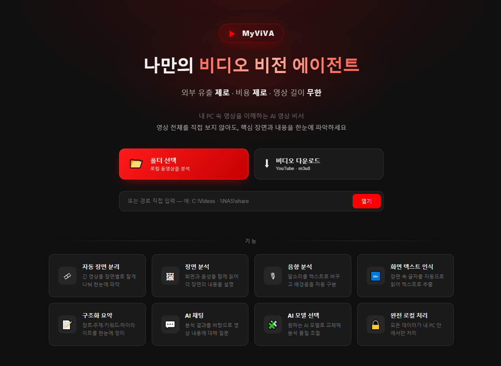

# MyViVA

**비디오를 처음부터 끝까지 다 보지 않아도, 핵심만 쏙 골라 이해할 수 있습니다.**

① 긴 강의 영상에서 **내가 필요한 개념만** 찾고 싶을 때  
② 밀린 드라마의 **전체 흐름을 빠르게** 파악하고 싶을 때  
③ 지루한 스포츠 경기에서 **짜릿한 하이라이트만** 모아보고 싶을 때

클라우드 AI(Gemini, GPT)를 쓰면 간단하지만, **회의 녹화본, 가족 영상, 사내 교육 자료**처럼 외부 유출이 민감한 비디오까지 전부 클라우드에 올릴 수는 없습니다.

**MyViVA**는 바로 이런 고민에서 시작되었습니다. 모든 AI 연동이 **내 컴퓨터에서 직접** 이루어지기 때문에, 소중한 영상 자산이 **외부로 유출될 걱정 없이 안전하게** 비디오를 분석할 수 있습니다.

👉 **[자세한 기능 소개 → PDF](product/MyViVA.pdf)**

---

## 세 가지 핵심

🔒 **외부 유출 제로** — 분석 중 인터넷 연결 불필요. 비디오는 내 컴퓨터 안에만 있습니다.

💸 **비용 제로** — 분당 요금도, 월 구독료도 없습니다.

⏱️ **길이 제한 없음** — 수십 초짜리 쇼츠부터 몇 시간짜리 강의까지 분석 가능합니다.

---

## ✨ 주요 기능

| 기능 | 설명 |
|------|------|
| **비디오 다운로드** | 유튜브 비디오 ID 혹은 URL로 다운로드 가능 |
| **폴더 탐색** | 로컬 비디오를 카드 형태로 정리, 분석 상태 표시, 즐겨찾기 |
| **영상 요약** | 유형·주제·핵심 내용·하이라이트·키워드 자동 생성 |
| **장면 분석** | 장면 설명·화면 텍스트(OCR)·대사(ASR)·배경음 분석 |
| **AI 채팅** | 비디오 내용을 근거로 자연어 질문 응답 |

---

## 🚀 시작하는 방법

**[⬇ MyViVA_Setup.exe 다운로드](https://github.com/SkiddieAhn/MyViVA/raw/refs/heads/main/MyViVA_Setup.exe)**

1. **`MyViVA_Setup.exe`** 를 실행합니다.
2. 설치 중 AI 모델 다운로드가 자동으로 진행됩니다 (인터넷 필요, 10~20분 소요).
3. 설치 완료 후 **`MyViVA.exe`** 를 실행합니다.
4. 준비가 완료되면 브라우저가 자동으로 열립니다.

**제거** — 제어판 → 프로그램 제거에서 **MyViVA** 선택 후 제거하면 됩니다.

---

## 💻 시스템 요구사항

| 항목 | 최소 | 권장 |
|------|------|------|
| **OS** | Windows 10 64-bit | Windows 11 |
| **RAM** | 16 GB | 32 GB 이상 |
| **GPU** | VRAM 6 GB (CUDA) | VRAM 12 GB 이상 |
| **저장 공간** | 30 GB 여유 | 50 GB 이상 |

---

## 🤖 사용 모델

| 기능 | 모델 | 실행 방식 |
|------|------|---------|
| **음성 인식** | Faster Whisper | 로컬 모델 |
| **배경음 분류** | LAION CLAP | 로컬 모델 |
| **화면 텍스트 인식** | Gemma4:e2b / e4b | Ollama |
| **장면 분석·요약** | Gemma4:e2b / e4b | Ollama |
| **AI 채팅** | Gemma4:e2b / e4b | Ollama |

Ollama 모델은 설정에서 원하는 모델로 교체할 수 있습니다.

---

## ⏱️ 분석 소요 시간

영상 재생 시간보다 약 **6~10배** 빠르게 분석이 완료됩니다. (OCR 포함 시 약 **4~8배**)

**OCR 미포함**

| 영상 길이 | gemma4:e2b | gemma4:e4b |
|---------|-----------|-----------|
| 15분    | 약 1.6분   | 약 2.6분   |
| 30분    | 약 3.1분   | 약 3.4분   |
| 60분    | 약 6.1분   | 약 7.1분   |

**OCR 포함**

| 영상 길이 | gemma4:e2b | gemma4:e4b |
|---------|-----------|-----------|
| 15분    | 약 3.2분   | 약 3.9분   |
| 30분    | 약 4.0분   | 약 5.3분   |
| 60분    | 약 7.2분   | 약 10.1분  |

측정 환경: NVIDIA RTX 2060 6GB · RAM 32GB · Intel i5-10400

---

v0.1.0 · 제작: 안성현 · skd@yonsei.ac.kr · 마지막 업데이트 2026.05.25
